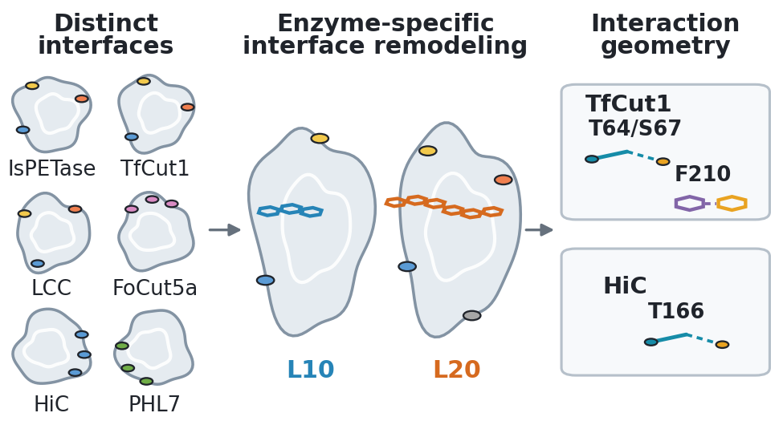

# PETase-MD-2026-review

## PET Chain Extension Remodels Protein–Polymer Interfaces across Natural PET Hydrolases

Xiaomei Deng and Christian D. Lorenz



## Abstract

Enzymatic degradation of poly(ethylene terephthalate) (PET) requires PET
hydrolases to bind and accommodate polymer chains at their surfaces, but how
substrate engagement varies among enzymes and with polymer chain length
remains poorly understood. Here, we used all-atom molecular dynamics simulations
to compare six natural PET hydrolases interacting with oligomers containing 4,
10, or 20 repeat units. In total, we analyzed 126 independent 100-ns simulations,
of which 71 met a prespecified global retention threshold and entered
residue-level contact analysis. The retained ensembles displayed distinct
interface architectures: IsPETase, TfCut1, and LCC used combinations of residues
around the catalytic site, W-loop, and binding cleft; FoCut5a interactions were
concentrated around its flap and binding-loop regions; HiC predominantly used
cleft-lining residues; and PHL7 strongly engaged its substrate-binding subsites.
Increasing PET length from 10 to 20 repeat units did not simply increase
association. Instead, it redistributed contacts in an enzyme-specific manner,
with the clearest residue-level changes in TfCut1 and HiC. Longer PET chains
increased direct hydrogen-bond occupancies involving TfCut1 Thr64 and Ser67 and
HiC Thr166, and increased aromatic-ring proximity involving TfCut1 Phe210.
These results show that PET hydrolases differ both in their retention of PET
and in how their retained interfaces accommodate longer polymer chains. The
identified interaction patterns and residues provide testable hypotheses for
mutagenesis, reactive calculations, and experimental studies of PET recognition
and hydrolytic activity.

## Use this repository

The data and code here support production-MD replay, numerical analysis, and
figure/table reproduction. Inputs for the commands below are included locally;
software dependencies are installed separately. Manuscript and Supporting
Information documents are provided through the journal submission system.

| Start here | Purpose |
|---|---|
| [environment/](environment/README.md) | Install the tested software environment |
| [01_simulation/](01_simulation/README.md) | Inspect inputs or replay production MD |
| [02_postprocessing/](02_postprocessing/README.md) | Recalculate statistics and generate tables and supplementary data |
| [03_figures/](03_figures/README.md) | Regenerate the six main figures, nine SI figures, and TOC graphic |

## Quick start

After installing the environment, run from the repository root:

```bash
python -B verify.py --checksums-only
python -B verify.py
```

The first command checks file integrity and required inputs. The second also
checks preparation metadata and recalculates statistics and tables. Use the
module instructions above to save analysis or figure outputs in a new directory
outside this checkout. Add `--verbose` to `verify.py` for detailed diagnostics.

## What can be reproduced?

Production replay uses 126 original TPR inputs. Analysis starts from the
supplied measurements, and figures use those data and selected structures.
The original full trajectories are not included: replay produces a new
simulation, not the original frames.

- [Reproduction scope and verification](REPRODUCIBILITY.md)
- [Data fields, units, and statistical definitions](02_postprocessing/DATA_GUIDE.md)

The `metadata/` directory holds machine-readable indexes and integrity records;
you do not need to read these files to use the commands above.

## License and citation

Project code and documentation use the [MIT License](LICENSE). Third-party
structures, force fields, and software retain their own terms.

If you use these materials, cite this repository and identify the Git revision:
[PETase-MD-2026-review](https://github.com/XMayDeng/PETase-MD-2026-review).
